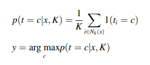
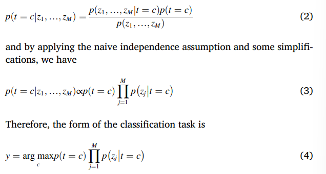

- [Resenha - Artigo: Machine learning for internet of things data analysis: a survey](#resenha---artigo-machine-learning-for-internet-of-things-data-analysis-a-survey)
  - [Intodução](#intodução)
  - [Revisão Literaria](#revisão-literaria)
  - [Internet of Things (IoT)](#internet-of-things-iot)
  - [Smart City](#smart-city)
  - [Taxonomy of machine learning algorithms](#taxonomy-of-machine-learning-algorithms)
    - [K-Nearest Neighbors (KNN)](#k-nearest-neighbors-knn)
    - [Naive Bayes](#naive-bayes)
    - [Random Forest](#random-forest)
    - [K-Means](#k-means)
  - [Conclusão](#conclusão)

# Resenha - Artigo: Machine learning for internet of things data analysis: a survey

## Intodução 

No presente artigo, o autor começa falando sobre a maneira como os dispositivos se comunicam foram evoluindo ao longo dos anos, desde a primeira geração de dispositivos, que se comunicavam através de cabos, até a quarta geração, que se comunicam através de redes sem fio e se tornou a denominada Internet das Coisas (IoT). Dessa forma, ao longo dos anos, a maneira como os seres humanos desenvolvem e se comunicam com os dispositivos também foi evoluindo, e com isso, a quantidade de dados gerados por esses dispositivos também aumentou, e com isso, a necessidade de acessar ou analisar esses dados foi crescendo. Surgindo então a ciência de dados, que é a combinação de diferentes campos científicos que utiliza mineração de dados, aprendizado de máquina e outras técnicas para encontrar padrões e novas percepções a partir dos dados. Essas técnicas incluem uma ampla gama de algoritmos aplicáveis em diferentes domínios.

Esse processo de aplicação de análise de dados em áreas específicas envolve a definição de tipos de dados, como volume, variedade e velocidade; modelos de dados, como redes neurais, classificação e métodos de agrupamento; e a aplicação de algoritmos eficientes que correspondam às características dos dados. Mas, para que esses algoritmos sejam aplicados, é necessário que os dados sejam pré-processados, para que sejam removidos dados redundantes, incompletos ou inconsistentes, e assim, os dados sejam transformados em dados de alta qualidade. Como fizemos ao longo do projeto, testando hipóteses e maneiras de limpar aqueles dados crus que foram coletados. Por mais que exista esse processo, ainda pode existir fluxo de dados de alta velocidade, que podem ser difíceis de serem processados, sendo denominados Big Data.

O autor do artigo traz a definição: "Big data é definido como dados de alto volume, alta velocidade e alta variedade que exigem formas de processamento de informações inovadoras e econômicas, que permitem insights aprimorados, tomada de decisões e automação de processos." e também o conceito de "Dados Inteligentes", como "Dados Inteligentes agregam valor ao aproveitar os desafios apresentados pelo volume, velocidade, variedade e veracidade do Big Data, e, por sua vez, fornecem informações acionáveis e melhoram a tomada de decisões". Isso podemos ver na prática sobre Big Data, por mais que o fluxo de arquivos ".PARQET" fosse grande, para aqueles que não tinham um computador com uma boa capacidade de processamento, era difícil de se trabalhar com esses dados, e por isso, mesmo utilizando o Google Colab, a memória RAM acabava estourando. Além de que o volume de dados era grande mas não significava que os dados se tornariam "Dados Inteligentes", pois, como vimos, muitos dados eram redundantes, incompletos ou inconsistentes, e por isso, não agregavam valor.

A partir dessas explicações e citações de outros autores, o autor do artigo define o objetivo do artigo, que é responder às seguintes questões: "How can machine learning algorithms be applied to IoT smart data?", "What is the taxonomy of machine learning algorithms that can be adopted in IoT?", "What are the characteristics of IoT data in the real world?" e "Why is the smart city a typical use case of IoT applications?". E para isso, o autor faz uma revisão sistemática da literatura, para identificar os métodos de aprendizado de máquina aplicados à análise de dados da IoT, e assim, identificar os métodos de aprendizado de máquina mais utilizados, os métodos de análise de dados da IoT mais utilizados e os métodos de aprendizado de máquina aplicados à análise de dados da IoT mais utilizados. O autor logo em seguida começa a trazer respostas para essas perguntas e algo engraçado que ele faz é sempre comparar aos humanos, mesmo que eles consigam esquematizar modelos, a mente humana ainda não consegue processar tantos dados em tão pouco tempo, e por isso, a necessidade de se utilizar algoritmos de aprendizado de máquina.

## Revisão Literaria

Logo no início, o autor cita outros artigos que seguem a mesma lógica do artigo em questão, dando um breve overview sobre como os modelos foram utilizados em diferentes contextos, desde a utilização de frequências de rádio até dados de e-commerce, indústria e etc. É válido destacar que o autor cita artigos que vão variando sua aplicação e o fluxo de dados que foi trabalhado, além do resultado final.

Muitos desses exemplos que foram citados, encaixam no projeto desenvolvido pela questão dos tipos de sensores que geraram aqueles dados que foram trabalhados, e também, a maneira como os dados foram coletados, que foi através de um fluxo de armazenamento de dados.

Todos eles começam seguem um fluxo, sendo:

Motivação: Que no caso do projeto foi a necessidade de se analisar os dados gerados pelos sensores dos aviões de modelo E2 para manutenção preditiva.
Use case: Sendo as aeronaves da Embraer, que são os aviões de modelo E2.
Processamento: Sendo o processo de ETL, exploração e visualização dos dados, treinamento de modelos e avaliação dos modelos, seja por pycaret ou por modelos de regressão temporal.
Conclusão: Discussão dos resultados obtidos e possíveis melhorias.
Todos esses processos foram acontecendo e sendo relembrados a cada sprint para sempre tentar obter o melhor modelo possível, e assim, obter os melhores resultados possíveis.

Logo em seguida, o autor também destaca o seguinte: "Here, it is summarized that data mining on IoT data involves three major concerns: First, it must be shown that processing the data will solve the chosen problems". Logo quando recebemos os datasets, notei que os arquivos tinham muitas colunas que não se relacionavam e que também ao longo do tempo, os números zeros das colunas não representavam dados faltantes. Em conversa com o orientador, sempre falei que os dados não eram confiáveis, e por isso, não poderiam ser utilizados para treinar um modelo. Mas mesmo assim ele falava "treine o modelo e veja", mesmo sabendo que daria algo errado, e deu. Isso fez com que recebêssemos novos datasets, que foram os que utilizamos para treinar os modelos apenas na sprint para a 4.

## Internet of Things (IoT)

Um dos benefícios da IoT é que ela pode ser aplicada em diferentes áreas, como saúde, transporte, agricultura, manufatura, etc. E com isso, a quantidade de dados gerados por esses dispositivos também aumentou, aos quais podem ser utilizados para simplificar a vida das pessoas, como por exemplo, reduzir o tempo de viagem, melhorar a qualidade do ar, reduzir o consumo de energia, etc. Esses dispositivos podem se comunicar por: Device to Device (D2D), Device to Server (D2S) e Server to Server (S2S).

Dessa forma, podemos classificar que os sensores dos aviões de modelo E2, se encaixam na categoria de D2S, pois os dados são coletados e armazenados em um servidor, e assim, podem ser acessados por diferentes pessoas, como os engenheiros de manutenção, que podem utilizar esses dados para fazer a manutenção preditiva das aeronaves. E o sistema de manutenção preventiva pode ser categorizado como um sistema de IoT, pois ele utiliza os dados gerados pelos sensores dos aviões para prever quando será necessário fazer a manutenção das aeronaves.

Também podemos categorizar como Cloud computing a AWS Academy, que foi utilizada para hospedar, armazenar e processar algumas partes do projeto, como o banco de dados, deploy do Dashboard, Lambda do modelo. E também, o Google Colab, que foi utilizado para estruturar os códigos de ETL e de treinamento dos modelos.

## Smart City

O autor cita que a Smart City é um dos casos de uso mais típicos da IoT, pois ela pode ser aplicada em diferentes áreas, como transporte, saúde, educação, etc. O mesmo pode ser afirmado do setor de aviação, que vem automatizando seus processos por meio da integração entre dispositivos IoT, sistemas, cloud e etc. Cada vez mais o setor vem procurando soluções tecnológicas para melhorar a eficiência e reduzir custos. A Azul, por sua vez, vem investindo em tecnologia para melhorar a eficiência de seus processos, e com isso, reduzir custos e melhorar a experiência do cliente. Consequentemente, o setor de aviação vem se tornando um "Use Case", devido a cada vez mais, as empresas do ramo estarem investindo em tecnologia para melhorar seus processos.

Por sua vez, ao desenvolver um sistema de manutenção preditiva, a Azul consegue melhorar a eficiência de sua frota, reduzir gastos com manutenção e gasto de combustível, atingindo uma de suas metas de sustentabilidade, que é reduzir o consumo de combustível. Além disso, a Azul consegue melhorar a experiência do cliente, pois, com a manutenção preditiva, a aeronave não precisa ficar muito tempo em manutenção, e assim, não atrasa os voos. Tudo isso se assemelha com o que o autor cita sobre a Smart City, que é a aplicação de IoT em diferentes áreas, e com isso, melhorar a qualidade de vida das pessoas.

Em outra parte do texto, mas ainda na mesma seção, o autor faz um alerta sobre 3 coisas, sendo elas: "1) Erro nas medições ou precisão da coleta de dados", "2) Ruído dos dispositivos no ambiente" e "3) Observações e medições discretas". Embora o autor traga pontos negativos sobre as falhas dos sensores ou observações, uma mais preocupante seria como é feita a construção de soluções tecnológicas, principalmente quando gostamos da área à qual o projeto segue a linha. Muitas vezes, saímos fazendo as coisas sem planejamento ou sem um estudo mais aprofundado, e com isso, acabamos criando soluções que não são eficientes ou que não agregam valor. E com isso, acabamos gastando tempo e dinheiro, que poderiam ser investidos em outras coisas.

## Taxonomy of machine learning algorithms

Nessa seção, o autor cita os diferentes tipos de algoritmos de aprendizado de máquina, sendo eles: Supervised Learning, Unsupervised Learning e Reinforcement Learning . E com isso, o autor cita os diferentes tipos de algoritmos que podem ser utilizados em cada um desses tipos de aprendizado de máquina. 

Durante o projeto, utilizamos diferentes algoritmos de aprendizado de máquina, como regressão linear, regressão logística, random forest, xgboost, etc. E com isso, podemos dizer que o projeto se encaixa na categoria de "Supervised Learning", pois os dados utilizados para treinar os modelos, já tinham a variável resposta, que era se houve falha sistema bleed no ciclos da aeronave. 

### K-Nearest Neighbors (KNN)

O modelo KNN, é um modelo de aprendizado de máquina supervisionado, que pode ser utilizado para classificação ou regressão. Esse modelo é utilizado para classificar um novo ponto de dados com base nos pontos de dados que estão mais próximos a ele. Esse modelo é utilizado para classificação ou regressão, e para isso, é necessário definir o valor de K, que é o número de vizinhos mais próximos que serão considerados para classificar o novo ponto de dados.

Tanto a parte da programação quanto matemática, foi algo que foi abordado no projeto, o que é importante para ajudar a entender como o modelo funciona. E com isso, o autor cita a seguinte equação:

De maneira resumida, o modelo KNN, calcula a distância entre o novo ponto de dados e os pontos de dados que estão mais próximos a ele, e assim, classifica o novo ponto de dados com base na classe dos pontos de dados que estão mais próximos a ele.

### Naive Bayes

O modelo Naive Bayes, é um modelo de aprendizado de máquina supervisionado, que pode ser utilizado para classificação ou regressão. Esse modelo é utilizado para classificar um novo ponto de dados com base na probabilidade de cada classe. 

No texto, o autor cita a seguinte equação:

Durante a utilização do Naive Bayes, não foi necessário entender a parte matemática, pois, o modelo foi utilizado através da biblioteca do pycaret, e com isso, o modelo foi treinado e avaliado, e assim, foi possível notar que o modelo tinha uma acurácia boa mas que não era o melhor modelo para o problema.

### Random Forest

O modelo Random Forest, é um modelo de aprendizado de máquina supervisionado, que pode ser utilizado para classificação ou regressão. Esse modelo é utilizado para classificar um novo ponto de dados com base na probabilidade de cada classe.

Quanto utilizamos o a library do pycaret, o modelo Random Forest, foi um dos modelso que teve a melhor acurácia, devido a sua capacidade de lidar com dados desbalanceados. Mas ainda era nitido que os dados precisavam ser balanceados.

### K-Means

Logo no início do projeto, a ideia era utilizar o modelo K-Means, para fazer a clusterização dos dados, e assim, tentar identificar padrões nos dados. Esse modelo é um modelo de aprendizado de máquina não supervisionado, que é utilizado para agrupar os pontos de dados em clusters, com base na distância entre eles.

Mas o modelo não foi utilizado, pois não foi possível identificar padrões nos dados com base nos datasets iniciais recebidos, e com isso, não foi possível fazer a clusterização dos dados.

## Conclusão

A análise de dados é uma área importante de pesquisa para cidades inteligentes, pois pode ser usada para aprimorar e otimizar diversos serviços. Ao escolher um algoritmo de análise de dados para dados inteligentes, é importante considerar as características da aplicação e os tipos de dados que serão analisados. Este artigo revisa muitos estudos de análise de dados de IoT e fornece uma visão geral dos algoritmos analíticos disponíveis, bem como suas especificações de aplicações.

O autor consegue explicar de forma clara a relação das cidades inteligentes que utilizam IoT e como os dados gerados por esses dispositivos podem ser utilizados para melhorar a qualidade de vida das pessoas. Com isso, o autor consegue responder as perguntas que foram feitas no início do artigo, sendo elas:

1. Como os algoritmos de aprendizado de máquina podem ser aplicados aos dados inteligentes da IoT?
2. Qual é a taxonomia dos algoritmos de aprendizado de máquina que podem ser adotados na IoT?
3. Quais são as características dos dados da IoT no mundo real?
4. Por que a cidade inteligente é um caso de uso típico das aplicações da IoT?
   
Além disso, a maneira como o autor explica as fórmulas de dois algoritmos de aprendizado de máquina, usando uma linguagem de baixo código, ajuda a entender como os modelos funcionam. Isso, por sua vez, ajuda a entender como os modelos foram treinados e avaliados. Também é importante notar como o projeto se relaciona com a temática do artigo.

O autor fornece um entendimento melhor sobre a aplicação de algoritmos de aprendizado de máquina na análise de dados da IoT e como isso pode ser aplicado nesta reta final do projeto.