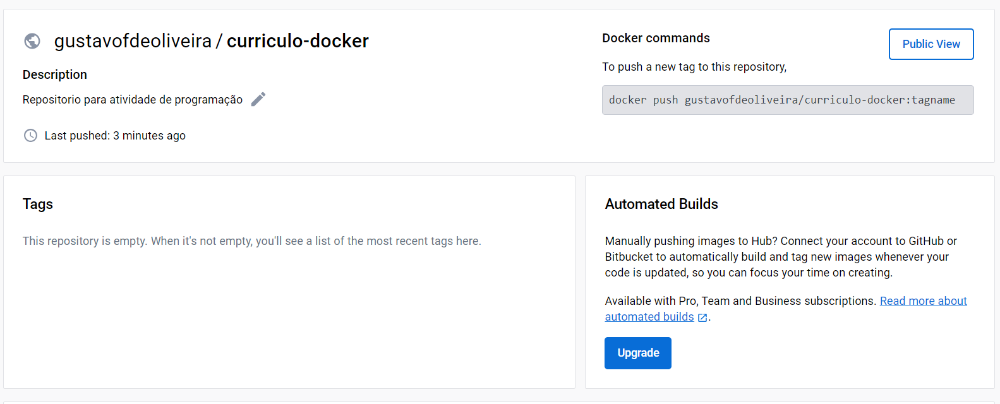
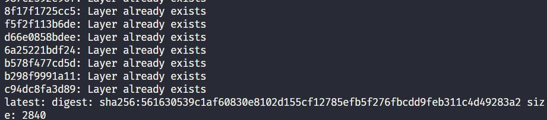

# Construindo um Container Docker para um Currículo com HTML, Bootstrap e Node.js

Este projeto tem como objetivo colocar em pratica como construir um container Docker para hospedar um currículo pessoal simples desenvolvido com HTML, Bootstrap e Node.js. O uso de um container Docker permite empacotar todas as dependências do projeto em um ambiente isolado, tornando mais fácil compartilhar e executar o currículo em diferentes ambientes.

## Passos para Construir o Container Docker

### 1. Front-end do Currículo

O front-end do currículo é composto por um arquivo HTML simples e um arquivo CSS do Bootstrap. O arquivo HTML contém o conteúdo do currículo e o arquivo CSS do Bootstrap fornece o estilo. O front-end do currículo é armazenado na pasta `frontend` do projeto.

### 2. Criando o Dockerfile

O arquivo `Dockerfile` é essencial para construir a imagem Docker. Aqui está um exemplo básico de um Dockerfile para este projeto:

<pre>

Dockerfile<button class="flex ml-auto gap-2"><svg stroke="currentColor" fill="none" stroke-width="2" viewBox="0 0 24 24" stroke-linecap="round" stroke-linejoin="round" class="h-4 w-4" height="1em" width="1em" xmlns="http://www.w3.org/2000/svg"><path d="M16 4h2a2 2 0 0 1 2 2v14a2 2 0 0 1-2 2H6a2 2 0 0 1-2-2V6a2 2 0 0 1 2-2h2"></path><rect x="8" y="2" width="8" height="4" rx="1" ry="1"></rect></svg>Copy code</button>

<code class="!whitespace-pre hljs language-Dockerfile"># Use uma imagem base leve do Node.js
FROM node:14-slim

# Define o diretório de trabalho dentro do container
WORKDIR /usr/src/app

# Copia os arquivos do currículo para o diretório de trabalho no container
COPY  package*.json ./

# Instala as dependências do projeto (não são necessárias neste caso, mas podem ser necessárias para projetos mais complexos)
RUN npm install

# Expor a porta que será usada para acessar o currículo
EXPOSE 80

# Comando para iniciar o servidor Node.js
CMD ["node", "index.js"]
</code>

</pre>

### 3. Criando o arquivo .dockerignore

O arquivo `.dockerignore` é usado para listar os arquivos que não devem ser copiados para o container durante a construção da imagem. Para um projeto HTML/Bootstrap/Node.js simples, você pode usar o seguinte conteúdo:

<pre>

lua<button class="flex ml-auto gap-2"><svg stroke="currentColor" fill="none" stroke-width="2" viewBox="0 0 24 24" stroke-linecap="round" stroke-linejoin="round" class="h-4 w-4" height="1em" width="1em" xmlns="http://www.w3.org/2000/svg"><path d="M16 4h2a2 2 0 0 1 2 2v14a2 2 0 0 1-2 2H6a2 2 0 0 1-2-2V6a2 2 0 0 1 2-2h2"></path><rect x="8" y="2" width="8" height="4" rx="1" ry="1"></rect></svg>Copy code</button>

<code class="!whitespace-pre hljs language-lua">node_modules
npm-debug.log
</code>

</pre>

### 4. Construindo a Imagem Docker

Abra um terminal na pasta raiz do projeto e execute o seguinte comando para construir a imagem Docker:

<pre>

bash<button class="flex ml-auto gap-2"><svg stroke="currentColor" fill="none" stroke-width="2" viewBox="0 0 24 24" stroke-linecap="round" stroke-linejoin="round" class="h-4 w-4" height="1em" width="1em" xmlns="http://www.w3.org/2000/svg"><path d="M16 4h2a2 2 0 0 1 2 2v14a2 2 0 0 1-2 2H6a2 2 0 0 1-2-2V6a2 2 0 0 1 2-2h2"></path><rect x="8" y="2" width="8" height="4" rx="1" ry="1"></rect></svg>Copy code</button>

<code class="!whitespace-pre hljs language-bash">docker build -t curriculo-docker .
</code>

</pre>

* `-t curriculo-docker`: Isso atribui o nome "curriculo-docker" à imagem.

Após a execução deste comando, o Docker executará as etapas definidas no Dockerfile para criar uma imagem que contém o seu currículo e as dependências do Node.js, se houver.

### 5. Upload no Docker Hub

Para subir no docker hub, basta seguir os seguintes passos:

1. Criar o repositorio no docker hub
2. Fazer login no docker pelo ser terminal com o comando:
   ``docker login --username  <username>``
3. Vai pedir para digitar a senha
4. Build a imagem com o comando:
   ``docker build -t <username>/<nome da imagem> .``
5. Verificar se a imagem foi criada com o comando:
   ``docker images``
6. Crie uma tag para a imagem com o comando:
   ``docker tag <id da imagem> <username>/<nome da imagem>``
5. Após isso, basta dar um push na imagem com o comando:
   ``docker push <username>/<nome da imagem>``

### 6. Docker Hub

Para acessa a imagem, acesse o docker hub:
https://hub.docker.com/repository/docker/gustavofdeoliveira/curriculo-docker/general

Nota: Quando fui subir para o docker hub, a imagem não apareceu mas conseguia dar pull ou push na imagem

## Conclusão

Ao seguir os passos acima, você terá construído uma imagem Docker que encapsula seu currículo HTML/Bootstrap/Node.js.
